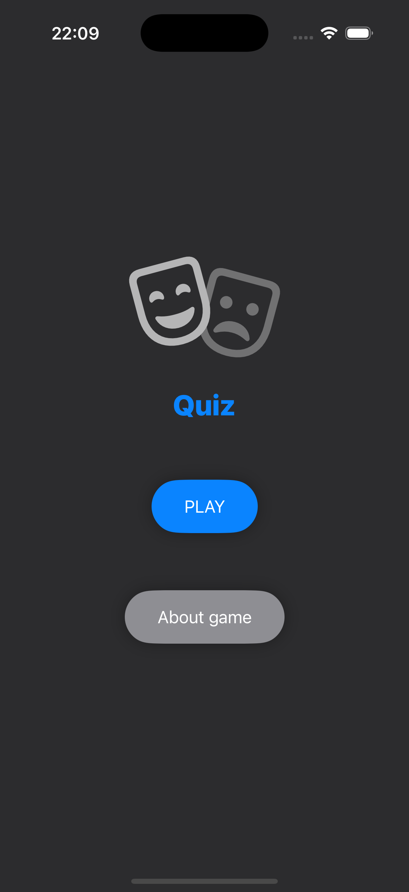

# SwiftUI Quiz App


This is a super simple Quiz app using SwiftUI and the Open Trivia Database API.
Questions span across various categories and you can track your high score!

## Features

- Randomly selects questions from multiple categories:
  - General knowledge
  - Entertainment
  - Television
  - Science
- True/False question format
- Real-time score tracking
- High scoring using UserDefaults
- Asynchronous data fetching

## API

This app uses the Open Trivia Database API to fetch trivia questions.

## Screenshots

<p align="center">
  
  
  
</p>

## Requirements

- iOS 15.0+
- Xcode 13.0+
- Swift 5.5+

## Installation

1. Clone the repository:
```bash
git clone https://github.com/yourusername/swiftui-quiz-app.git
```

2. Open the project in Xcode:
```bash
cd swiftui-quiz-app
open SwiftUIQuizApp.xcodeproj
```

3. Build and run the app on a simulator or a physical device.

## Usage

1. Launch the app.
2. Answer the quiz questions by selecting True or False.
3. Try to beat your high score!


